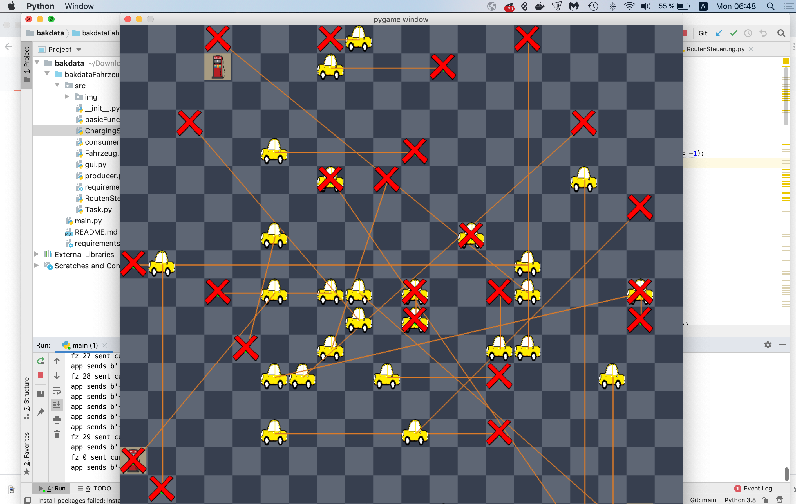

# bakdataFahrzeuge

To run this project, simply navigate to the root directory and execute the command python3 main.py from your terminal

## Non-visual mode
The non-visual mode fulfils all of the functionalty of the visual mode, without the visual aspect. Its interpretation relies solely on console and log-file output. This is structured in the following manner:

1: When the script is started (as previously described), first the Kafka Streams app is initialized with the number of cars, tasks, charging stations, board size, etc. The number of cars are then initialized accordingly, each with a unique id. Furthermore, each car has its own log-file. These can be found at ./logs/logForCar-{id}.txt for the id of that car. When a car has been successfully initialized, it logs "fz {id} is listening". It then begins listening on the "nextPositions" Kafka topic.

1a: After the initialization of each car, a task is assigned to that car (assuming that there are more tasks than cars). That task starts at a random location and ends at a different random location. This event is logged.

2: While the car has not yet reached the starting location for the task:

  2a: The app sends the next square it needs to go to into the Kafka Topic "nextPositions", marking the message with the car's id
  
  2b: The car listens to all incoming messages on "nextPositions"; when it receives a message with its assigned id, it moves to that square and sends a message back to the app requesting its next square. Each transaction is logged.
  
3: When the car reaches the initial square, 2 (above) repeats itself, except for the ending square rather than beginning square.

4: When the car reaches the final destination, this is logged. If there are remaining tasks to be done, then the app creates a new task, starting at a random location and ending at a different random location. This event is logged. 2 (above) is repeated.

*At any time if the car has low battery, then it sends a message to the criticalBatteryTopic topic. This is logged. The app recceives this message, and rather than direct it towards the next target according to its task, it directs it towards the nearest charging station. Once it arrives, it sends a message to the car to charge. This is logged. Then it resumes directing the car to its assigned target.

## Visual mode
The visual mode provides a visual representation of the simulation. Represented are cars, charging stations, and their targets. The target of each car is indicated by a red x, marking the spot to which it must travel. There is an arrow drawn from each car to its respective target (if it currently has one). Once the visual mode has loaded, you must press the space bar for it to begin running.

The visual mode creates the same log files as does the non-visual mode.

It has several requirements; these are listed in requirements.txt

There are several run-time parameters which you may tweak in the header of main.py. Most important are:

numCars: the number of cars in the simulation
numTasks: the number of tasks which they must accomplish
movesUntilRecharge: the number of moves they can make before they need to go and find the nearest charging port
visual: whether you would like to include the visual pygame simulation

